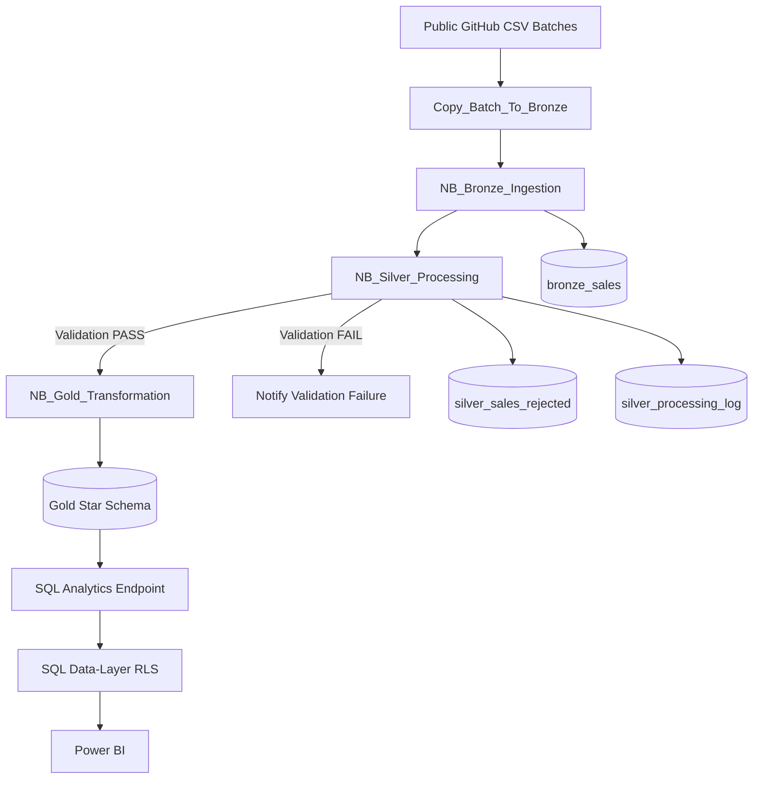
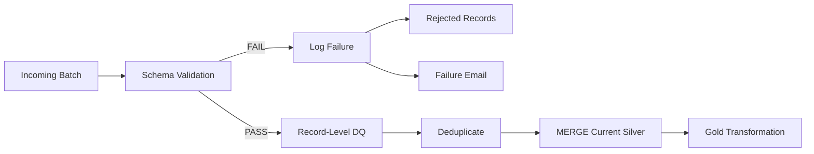

# Cargills Retail Analytics --- Microsoft Fabric


## 📌 Overview

This project implements an end-to-end retail analytics platform using
**Microsoft Fabric**.

Transactional sales data arrives as periodic CSV batches from a public
web source. The solution ingests each batch automatically, validates and
cleans the data, handles duplicates and corrections, protects customer
information, and publishes secured regional analytics through Power BI.

### Core objectives

-   Reliable HTTP-based batch ingestion
-   Parameterized and repeatable processing
-   Duplicate prevention and correction handling
-   Automated schema and record-level data-quality validation
-   Rejected-record quarantine and audit logging
-   Bronze → Silver → Gold architecture
-   SQL data-layer Row-Level Security (RLS)
-   Power BI regional sales and profitability reporting
-   Failure branching and email notification

------------------------------------------------------------------------

## 🏗️ Architecture



### Processing flow

``` text
Source CSV
    ↓
HTTP Copy
    ↓
Bronze
    ↓
Silver Validation
    ├── FAIL → Rejected Records + Log + Email
    │
    └── PASS → Current Silver → Gold → SQL RLS → Power BI
```

------------------------------------------------------------------------

## 🧰 Technology Stack

  Technology               Purpose
  ------------------------ -----------------------------------------------------
  Microsoft Fabric         End-to-end data engineering platform
  Fabric Data Pipeline     Batch orchestration
  Fabric Lakehouse         Layered Delta storage
  PySpark                  Validation, transformation, deduplication and MERGE
  Delta Lake               ACID storage and current-state processing
  SQL Analytics Endpoint   Analytical serving and security boundary
  SQL Row-Level Security   Regional data access control
  Power BI                 Business analytics and visualization
  GitHub                   Version control and documentation

------------------------------------------------------------------------

# 📂 Repository Structure

``` text
Cargills-Retail-Analytics/
│
├── 01_Notebooks/
│   ├── NB_Bronze_Ingestion.ipynb
│   ├── NB_Silver_Processing.ipynb
│   └── NB_Gold_Transformation.ipynb
│
├── 02_SQL/
│   ├── 01_table_definitions.sql
│   ├── 02_load_logic.sql
│   ├── 03_security_mapping.sql
│   ├── 04_rls_policy.sql
│   └── 05_demo_validation_queries.sql
│
├── 03_PowerBI/
│   └── Cargills_Retail_Analytics.pbix
│
├── 04_Screenshots/
│   ├── 01_master_pipeline_dependencies.png
│   ├── 02_successful_batch_run.png
│   ├── 03_batch3_validation_failure.png
│   ├── 04_batch3_rejected_records.png
│   ├── 05_batch3_failure_email.png
│   ├── 06_gold_unchanged_after_batch3.png
│   ├── 07_powerbi_rls.png
│   └── 08_direct_sql_rls.png
│
├── 05_Demo/
│   └── Cargills_DE_Demo.mp4
│
├── 06_Documentation/
│   ├── Cargills_DE_One_Page_Architecture_Summary.pdf
│   └── Cargills_DE_Architecture_and_Design_Decisions.docx
│
└── README.md
```

> **Public repository:** do not commit passwords, access tokens, private
> connection strings, workspace credentials, or customer PII.

------------------------------------------------------------------------

# 🔄 Pipeline Design

The master pipeline is:

``` text
Copy_Batch_To_Bronze
        │
        ▼
NB_Bronze_Ingestion
        │
        ▼
NB_Silver_Processing
        │
        ├──────── Success ────────► NB_Gold_Transformation
        │
        └──────── Failure ────────► Notify_Validation_Failure
```

The pipeline uses a parameter named:

``` text
batch_file_name
```

Example:

``` text
batch_01_history.csv
batch_02_incremental.csv
batch_03_incremental.csv
```

The same pipeline can therefore process different batches without
changing the pipeline definition.

------------------------------------------------------------------------

# 🥉 Bronze Layer

### Table

`bronze_sales`

The Bronze layer preserves incoming source records and adds technical
metadata:

-   `source_file_name`
-   `load_run_id`
-   `ingestion_timestamp`

### Batch identity

``` text
source_file_name → logical batch identity
load_run_id      → pipeline execution identity
```

This makes every ingestion traceable.

### Idempotent ingestion

The Bronze implementation uses the source batch identity to replace the
stored copy for that batch instead of blindly appending another copy.

The CSV reader also explicitly handles quoted and escaped fields so
values containing commas are parsed correctly.

------------------------------------------------------------------------

# 🥈 Silver Layer

Silver is responsible for:

1.  Schema validation
2.  Data-type standardization
3.  Record-level validation
4.  Rejected-record quarantine
5.  Duplicate detection
6.  Deduplication
7.  Incremental current-state updates
8.  Processing audit logging

------------------------------------------------------------------------

## 🔑 Business Key

The selected business key is:

``` text
row_id
```

### Why `row_id`?

The supplied assessment batches were profiled before implementation.

-   Batch 1 contains unique Row IDs.
-   Batch 2 contains corrected versions of existing Row IDs.
-   `order_id` is not unique because one order can contain multiple
    products.
-   `row_id` therefore provides the appropriate record-level matching
    key for this dataset.

------------------------------------------------------------------------

# ♻️ Incremental Processing & Corrections

The current Silver state is maintained using `row_id` as the MERGE key.

``` text
Incoming row_id
      │
      ├── New key      → INSERT
      │
      └── Existing key → UPDATE
```

Example:

``` text
Batch 1
row_id = 12345
sales  = 100

Batch 2
row_id = 12345
sales  = 120
```

Current state:

``` text
row_id = 12345
sales  = 120
```

This allows corrected records from later batches to replace stale
current-state values without creating duplicate records.

------------------------------------------------------------------------

# 🧪 Data Quality

Validation is performed before data is promoted to the reporting layer.

## Schema validation

Unexpected or missing source columns cause the batch to fail.

This protects downstream processing from unexpected structural changes.

## Record-level validation

The implemented rules identify issues including:

``` text
Missing Row ID
Missing Order ID
Missing Customer ID
Missing Region
Missing Sales
Sales <= 0
```

Invalid records are stored in:

`silver_sales_rejected`

Each rejected record retains its rejection reason.

### Validation policy

  Issue                               Handling
  ----------------------------------- ---------------
  Unexpected/missing schema columns   Stop batch
  Missing critical record value       Reject record
  Invalid Sales value                 Reject record
  Duplicate Row ID                    Deduplicate
  Valid new Row ID                    Insert
  Existing Row ID with correction     Update

> The `Sales <= 0` rule was selected after profiling the supplied
> assessment data. In a production environment, the source business
> contract would determine whether negative sales represent legitimate
> events such as returns.

------------------------------------------------------------------------

# 🚨 Failure Protection

A failed batch must not partially update the reporting layer.



For the Batch 3 demonstration:

-   Copy succeeds
-   Bronze ingestion succeeds
-   Silver validation fails
-   Rejected records are captured
-   Silver processing log records the failure
-   Failure email is sent
-   Gold transformation is not executed
-   Reporting remains on the last known good state

------------------------------------------------------------------------

# 📊 Batch Profiling

The supplied files were profiled before the pipeline rules were
finalized.

  ------------------------------------------------------------------------
  Batch                                Physical Rows Key Findings
  --------------------- ---------------------------- ---------------------
  Batch 1                                      6,675 Clean baseline

  Batch 2                                      3,384 Duplicate Row IDs and
                                                     corrected existing
                                                     records

  Batch 3                                        915 Schema drift, missing
                                                     values, duplicates
                                                     and invalid sales
  ------------------------------------------------------------------------

Batch 3 included:

-   An additional `order_channel` column
-   Missing Order IDs
-   Missing Customer IDs
-   Missing Regions
-   Missing Sales
-   Negative Sales values
-   Duplicate Row IDs

This batch was used to demonstrate the validation-failure path.

------------------------------------------------------------------------

# 🥇 Gold Layer

The Gold layer provides an analytical star-schema model.

### Fact table

`gold_sales_fact`

### Fact grain

> **One current sales record per `row_id`.**

### Dimensions

-   `gold_dim_date`
-   `gold_dim_product`
-   `gold_dim_region`

The fact contains measures and analytical attributes required for retail
reporting, including sales, quantity, discount, profit, date, product
and geography.

A deterministic `geo_key` represents the Region + State + City
combination for dimensional modelling.

> `geo_key` is a modelling key. It is separate from the security mapping
> used for RLS.

------------------------------------------------------------------------

# 🔐 Data Privacy

The source contains customer-related information such as:

-   Customer names
-   Postal codes

These fields are treated as personal data.

They are not exposed in the Gold reporting model because regional sales
analysis does not require identifying customer details.

This follows a least-exposure approach: sensitive information is not
propagated into reporting unless required.

------------------------------------------------------------------------

# 🛡️ Row-Level Security

Regional access is enforced at the **SQL data layer**.

The mapping table is:

`security_user_region`

``` text
User
  ↓
security_user_region
  ↓
Permitted Region
  ↓
SQL Row-Level Security
  ↓
gold_sales_fact
  ↓
Power BI
```

### Why data-layer RLS?

The assessment requires regional security to be enforced at the data
layer rather than relying only on Power BI report roles.

Power BI connects to the secured SQL Analytics Endpoint, so the
underlying data restriction applies to the reporting path as well.

The same security boundary can also be demonstrated through direct SQL
access.

------------------------------------------------------------------------

# 📈 Power BI

The Power BI report connects to the Gold layer through the Fabric SQL
Analytics Endpoint.

## Page 1 --- Sales Overview

Includes:

-   Total Sales
-   Total Profit
-   Profit Margin
-   Total Quantity
-   Transaction Count
-   Sales trend
-   Top products

## Page 2 --- Regional Performance

Includes:

-   Current permitted region
-   Sales by region
-   Profit by region
-   Category/product breakdown
-   Regional performance metrics

## Page 3 --- Regional Comparison

Provides regional comparison where the appropriate access mapping is
available.

> Correctness and security are prioritized over visual complexity.

------------------------------------------------------------------------

# 📋 Audit & Observability

## Bronze log

`bronze_ingestion_log`

Tracks:

-   `run_id`
-   `batch_file_name`
-   `ingestion_start_time`
-   `ingestion_end_time`
-   `status`
-   `rows_received`
-   `rows_written`
-   `failure_reason`

## Silver log

`silver_processing_log`

Tracks:

-   `run_id`
-   `batch_file_name`
-   `processing_start_time`
-   `processing_end_time`
-   `status`
-   `rows_received`
-   `rows_passed`
-   `rows_rejected`
-   `rows_after_deduplication`
-   `rows_written`
-   `failure_reason`

This provides execution-level traceability and supports investigation of
failed batches.

------------------------------------------------------------------------

# 🔁 Idempotency

The pipeline is designed to be safely rerunnable.

For current-state sales data:

``` text
COUNT(*) = COUNT(DISTINCT row_id)
```

A repeated batch is matched against the existing business keys rather
than blindly appended.

Therefore, rerunning Batch 2 should not create duplicate current-state
records.

------------------------------------------------------------------------

# 🚨 Failure Notification

The failure branch is:

``` text
NB_Silver_Processing
        │
        ├── Success → NB_Gold_Transformation
        │
        └── Failure → Notify_Validation_Failure
```

The notification communicates that the incoming batch failed validation
and that Gold/reporting processing was not executed.

This provides operational visibility through both pipeline history and
the notification channel.

------------------------------------------------------------------------

# ⚖️ Design Trade-offs

## PySpark vs Dataflows Gen2

### Selected: PySpark

PySpark provides direct control over:

-   Data-quality rules
-   Duplicate detection
-   Deduplication
-   Delta MERGE
-   Current-state processing
-   Schema validation

Dataflows Gen2 would be suitable for many lower-code transformation
workloads, but PySpark was selected here because the assessment requires
explicit stateful processing and validation logic.

------------------------------------------------------------------------

## DirectQuery vs Direct Lake / Import

The report uses the secured SQL Analytics Endpoint.

This makes the SQL security boundary explicit and allows the assessment
requirement for data-layer RLS and direct SQL security to be
demonstrated.

Direct Lake or Import could offer different Power BI performance
characteristics, but the selected design prioritizes the required
security architecture.

------------------------------------------------------------------------

# 📈 Scaling to 100M Rows/Day

For a workload approaching 100 million rows per day, the architecture
would require additional performance engineering.

### Storage

-   Incremental processing
-   Appropriate Delta partitioning
-   Small-file management
-   File-layout optimization

### Spark

-   Parallel partitioning
-   Optimized joins
-   Efficient MERGE operations
-   Avoidance of unnecessary full-table scans
-   Appropriate compute sizing

### Delta

-   Monitor file sizes and statistics
-   Optimize MERGE keys
-   Apply appropriate table-maintenance strategies

### Serving

-   Keep Gold tables narrow
-   Use pre-aggregations where appropriate
-   Monitor DirectQuery concurrency
-   Evaluate dedicated warehouse/serving patterns as workload grows

Likely bottlenecks would include MERGE performance, file management,
compute requirements and concurrent analytical access.

------------------------------------------------------------------------

# 🧪 Demonstration Scenarios

### 1️⃣ Batch 1 --- Baseline

``` text
Copy       ✓
Bronze     ✓
Silver     ✓
Gold       ✓
Power BI   ✓
```

### 2️⃣ Batch 2 --- Incremental + Corrections

``` text
New Row IDs
    → INSERT

Existing Row IDs
    → UPDATE

Duplicate current-state records
    → NONE
```

### 3️⃣ Batch 3 --- Validation Failure

``` text
Copy                       ✓
Bronze                     ✓
Silver validation          ✗
Rejected records           ✓
Processing log             ✓
Failure notification       ✓
Gold transformation       NOT EXECUTED
Reporting layer            UNCHANGED
```

### 4️⃣ Batch 2 --- Idempotent Rerun

The same batch is processed again.

Expected result:

``` text
No duplicate current-state Row IDs
No unintended row-count increase
Same current-state business results
```

------------------------------------------------------------------------

# 🔎 Useful Validation Queries

### Current row count and business-key uniqueness

``` sql
SELECT
    COUNT(*) AS row_count,
    COUNT(DISTINCT row_id) AS distinct_row_ids
FROM gold_sales_fact;
```

### Reporting totals

``` sql
SELECT
    COUNT(*) AS row_count,
    SUM(sales) AS total_sales,
    SUM(profit) AS total_profit
FROM gold_sales_fact;
```

### Regional access

``` sql
SELECT DISTINCT region
FROM gold_sales_fact;
```

### Rejected records

``` sql
SELECT TOP 20 *
FROM silver_sales_rejected;
```

### Processing history

``` sql
SELECT TOP 20 *
FROM silver_processing_log
ORDER BY processing_end_time DESC;
```

------------------------------------------------------------------------

# 📸 Evidence

The project evidence includes screenshots for:

1.  Master pipeline dependencies
2.  Successful Batch 1 run
3.  Batch 3 validation failure
4.  Batch 3 rejected records
5.  Failure notification
6.  Gold/reporting layer unchanged after Batch 3
7.  Power BI regional RLS
8.  Direct SQL regional RLS

------------------------------------------------------------------------

# 🚀 Reproduction

The implementation was developed in a Microsoft Fabric workspace.

Private authentication and connection configuration are intentionally
excluded from the public repository.

High-level setup:

``` text
1. Create a Microsoft Fabric workspace
2. Create a Lakehouse
3. Configure the source HTTP connection
4. Import the Bronze, Silver and Gold notebooks
5. Configure the master pipeline
6. Add batch_file_name as the pipeline parameter
7. Configure Notebook Activity Base parameters
8. Create/configure the required Delta tables
9. Configure the security mapping table
10. Apply SQL Row-Level Security
11. Connect Power BI to the secured SQL Analytics Endpoint
12. Run the demonstration batches
13. Validate success, failure and idempotency scenarios
```

------------------------------------------------------------------------


------------------------------------------------------------------------

# 🤖 AI Disclosure

AI-assisted development and online technical references were used during
development for:

-   Understanding Microsoft Fabric concepts
-   Exploring implementation approaches
-   Debugging and explaining code
-   Reviewing architecture and trade-offs
-   Improving documentation

The final implementation was reviewed and tested against the assessment
requirements, with the goal of keeping the architecture and
implementation explainable and defensible during technical discussion.

------------------------------------------------------------------------


------------------------------------------------------------------------

# 👨‍💻 Author

**Thiwanka Madhusanka**

BSc (Hons) Information Technology --- Data Science

**Areas of interest**

`Data Engineering` · `Data Analytics` · `Data Warehousing` ·
`Microsoft Fabric` · `SQL` · `Python` · `Power BI`

------------------------------------------------------------------------

## ⭐ Project Highlights

``` text
✓ Parameterized HTTP batch ingestion
✓ Bronze / Silver / Gold architecture
✓ Raw-data preservation
✓ Delta Lake processing
✓ Schema validation
✓ Data-quality validation
✓ Rejected-record quarantine
✓ Business-key deduplication
✓ Incremental MERGE processing
✓ Correction handling
✓ Idempotent reruns
✓ Processing audit logs
✓ Failure branching
✓ Failure notification
✓ Gold star schema
✓ Sensitive-data protection
✓ SQL data-layer RLS
✓ Power BI regional analytics
✓ 100M rows/day scaling considerations
```


